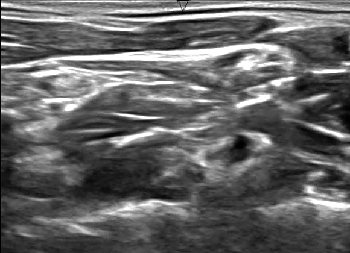

# 超声波神经识别器

项目来源于Kaggle上的[比赛](https://www.kaggle.com/c/ultrasound-nerve-segmentation)。

目前，外科手术过程中，为了让病人减少疼痛，通常使用致幻药品对病人进行麻醉，这种方式对病人的神经系统有很大损伤，术后恢复缓慢。

一种新的替代方案是在大脑的神经组织中植入置留导管（indwelling catheters），阻止或者减缓疼痛感传播，这种方式对病人的神经损伤很小，术后恢复更快。

该方法成功的关键在于准确识别神经结构，即从神经的超声波图像中找到臂丛神经（Brachial Plexus）。本项目就是为了这个目标而提出。

## 示例

典型的神经超声波图像如图：

经过训练的专家根据经验，会标记出臂丛神经的位置：

## 相关链接
[开发计划](https://github.com/ThoughtWorksInc/ultrasound-nerve-segmentation/wiki/%E5%BC%80%E5%8F%91%E8%AE%A1%E5%88%92)
